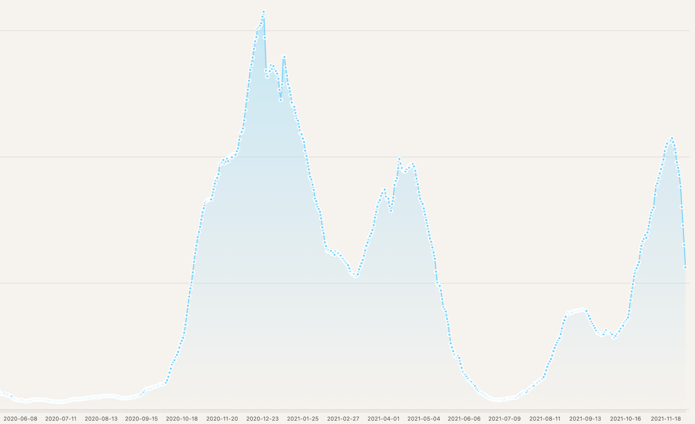

# Hospitalisierungsinzidenz Deutschland

Live-Anwendung: https://torstenwerner.github.io/bratwurst/

Es werden die Daten des Robert-Koch-Instituts zur Hospitalisierungsinzidenz für Deutschland angezeigt.
Die Daten werden vom RKI täglich aktualisiert.

Die Daten und weitere Erläuterungen dazu werden vom RKI unter der Adresse https://github.com/robert-koch-institut/COVID-19-Hospitalisierungen_in_Deutschland veröffentlicht.

Die Werte bis einschließlich Mai 2020 sind sehr ungenau, weil das Meldesystem zu dieser Zeit erst aufgebaut wurde.
Desweiteren gibt es einen Meldeverzug, so dass die aktuellsten Werte leider ungenau sind.

## Beispielchart

